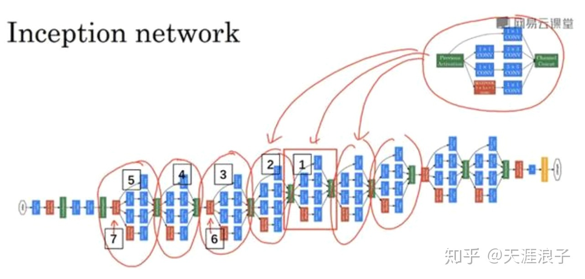

# Compilation Principal of Pytorch and TensorFlow (Prepare)

## Introduction

### Gradients

A nerual network is a function: $\hat y = f(x; \theta)$.
Training the function requires a loss function $L(\hat y, y)$ indicating the distance between our fitted values and real labels, and observed
data $x$ and $y$. SGD algorithm require we calculate the gradient of $L$ w.r.t.
$\theta$, aka $\frac{\partial L}{\partial \theta} = \frac{\partial L}{\partial \hat y}\frac{\partial \hat y}{\partial \theta}$.

Let's see how this can be done. Suppose we have a very simple function:

```python
def f(x, theta):
    return x[0] * theta[0] + x[1] * theta[1]
```

let:

```python
x = [0.1, 0.2]
theta = [0.1, -0.1]

yhat = f(x, theta)
assert yhat == -0.01
```

Now $\hat y$ is a number and we lost all the information about how `yhat` is calculated from $x$ and $\theta$. Thus we can't calculate the gradient $\frac{\partial \hat y}{\partial \theta}$. After all, what's $\frac{\partial -0.01}{\partial 0.1}$ supposed to be?

Let's try another solution.

```python
x = Tensor([0.1, 0.2])
theta = Tensor([0.1, -0.1])
def f(x, theta):
    a = Mul(x[0], theta[0])
    b = Mul(x[1], theta[1])
    c = Add(a, b)
yhat = f(x, theta)
assert yhat.data = -0.01
```

Now `yhat` is no longer a number. It's an expression (tree) object containing the whole computation path from inputs ($x$ and $\theta$) to the result ($\hat y$). We can use this information to calculate the gradient with the chain rule:

$$ \frac{\partial c}{\partial \theta_0} = \frac{\partial c}{\partial a}\frac{\partial a}{\partial \theta_0} = x_0 $$

or, in python:

```python
assert yhat.partial(theta[0]) == yhat.partial(a) * a.partial(theta[0]) == 1 * x[0] == x[0]
```

This is also how things are done in Pytorch and Tensorflow.

You may have noticed that the structure of `yhat` is very much like the expressions in numflow. Actually it's true. They all use expression trees to track the computation paths, except that what numflow does is more complicated. I will explain this in the main sector.


### Neural Networks

Neural Networks are recursive structures. They consist of smaller neural networks called "layers". Take the "inception" model for an example (the inception model is a deeplearning model developed by Google to classify images), Each small block in red/blue/green represents a layer. They are basic operations called "pooling", "convolution" and "concatenate". Each layer can be used as an independent neural network model if necessary.

The groups circled in red are identical structures. So they can be grouped into layers too. They are called the "inception blocks".

So the whole "inception" model can be divided into layers called inception blocks, and each inception block can again be divided into more basic layers. In this sense we say that the neural network forms a "neural network tree".


